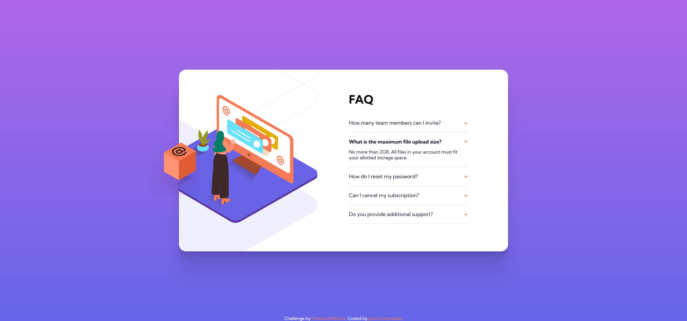

# Frontend Mentor - FAQ accordion card solution

This is a solution to the [FAQ accordion card challenge on Frontend Mentor](https://www.frontendmentor.io/challenges/faq-accordion-card-XlyjD0Oam). Frontend Mentor challenges help you improve your coding skills by building realistic projects. 

## Table of contents

- [Overview](#overview)
  - [The challenge](#the-challenge)
  - [Screenshot](#screenshot)
  - [Links](#links)
- [My process](#my-process)
  - [Built with](#built-with)
  - [What I learned](#what-i-learned)
  - [Continued development](#continued-development)
  - [Useful resources](#useful-resources)
- [Author](#author)
- [Acknowledgments](#acknowledgments)

## Overview

### The challenge

Users should be able to:

- View the optimal layout for the component depending on their device's screen size
- See hover states for all interactive elements on the page
- Hide/Show the answer to a question when the question is clicked

### Screenshot



### Links

- Solution URL: [Add solution URL here](https://your-solution-url.com)
- Live Site URL: https://jaycgreenwald.github.io/11-faq-accordian-card/
- GitHub URL: https://github.com/jaycgreenwald/11-faq-accordian-card

## My process


### Built with

- Semantic HTML5 markup
- CSS custom properties
- Flexbox
- CSS Grid
- Mobile-first workflow

### What I learned

- Using background images and how to position them
- New CSS combinators
- I dabbled in CSS transitions for the first time
- I read a lot about the best way to hide content for different situations

```css
input:checked + .faq__label::after {
    transform: rotate(-180deg);
}

input:checked ~ .faq__answer {
    max-height: 100vh;
    padding-bottom: 18px;
    display: block;
    transition: all 0.35s;
}
```

### Continued development

- Should I be splitting my CSS into multiple files? It seems like I probably should just to make maintenance easier. If true, should I just start learning SASS?

- I want to keep learning more about CSS transitions.

- More Figma

### Useful resources

- [Places it’s tempting to use `display: none;`, but don’t](https://css-tricks.com/places-its-tempting-to-use-display-none-but-dont/) - I recently read that using display: none was not always the preferred method for hiding content for accessibility reasons. So I did a little research and found this article. I read through the comments, then read more articles. 

## Author

- Website - [jaycgreenwald](https://github.com/jaycgreenwald)
- Frontend Mentor - [@jaycgreenwald](https://www.frontendmentor.io/profile/jaycgreenwald)
- Twitter - [@jaycgreenwald](https://www.twitter.com/jaycgreenwald)

## Acknowledgments

As always, the Frontend Mentor Slack and my accountability group where I report on daily progress.